## Project 3.1 - Upgrading Devolearn

## 1. Segmenting Nuclei in C. elegans embryo
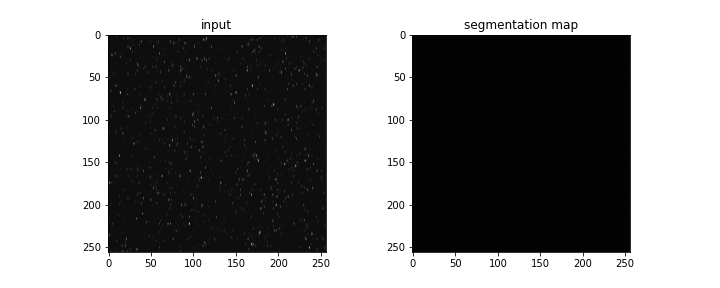

### 1.1 The Dataset:
The dataset is sourced from the [Cell-Tracking-Challenge](http://celltrackingchallenge.net/) website. I discovered this website while gliding over [this paper](https://www.nature.com/articles/s41540-020-00152-8).

It contains 3D+t fluorescence microscopy data of the developing C. elegans embryo with corresponding segmentation maps. 

The dataset is by no means ideal, it was scattered across multiple folders and contains many useless datapoints near the extreme ends of the dorsal-ventral axis. The images were stored in `.tif` format, which added to the challenge.

### 1.2 JPEG Vs PNG:
I had made the mistake of converting the `.tif` files into `.jpeg`, not realising that it is a lossy compression method, it changes pixel level values as long as it “looks good” to the human observer.

### 1.3 Preprocessing to Avoiding CPU Bottlenecks
To prevent anu CPU bottlenecks while training, I used PIL to resize all the training images to 1x256x256 beforehand.

### 1.4 Image Augmentation:
Used Albumentations to define the image augmentation pipeline. Also defined a custom class to add gaussian noise in training images (features).

### 1.5 Defining The Dataset and Dataloader in PyTorch:

I did not want to use torchvision.datasets.ImageFolder() for the dataset class. While converting data from `.tif` to `.png`, I ensured that the filenames (both features and labels) contain the time-point and slice number, which could be used to identify unique feature-label pairs.

I created a Pandas DataFrame that contains these unique id’s and saved it as a csv file, using which the custom dataloader loads valid feature-label pairs. The image below showcases a feature-label pairs sampled from the PyTorch dataloader.

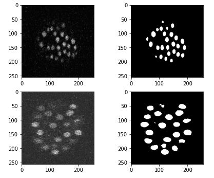

### 1.6 The Model:
* Type - Feature Pyramid Network
* Backbone - ResNet-18

### 1.7 Automated Hyperparameter tuning using Optuna:
Optuna is a hyperparameter optimization framework capable of automating the process of hyperparameter tuning  .Optuna samples hyperparams from a given range, which in this case was -
* Learning rate: 0.5e-3 to 20e-3
* Batch Size: 8 to 64

Each trial trained the model on 10% of available data for 3 epochs, and returned the resulting IOU score. The hyperparams from the best optuna trial is shown in the image below

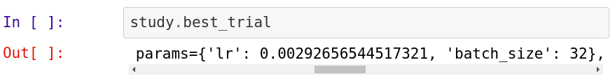

### 1.8 Training Metrics:
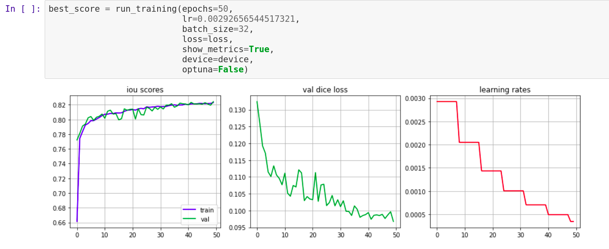

### 1.9 Model Performance on Validation Data:

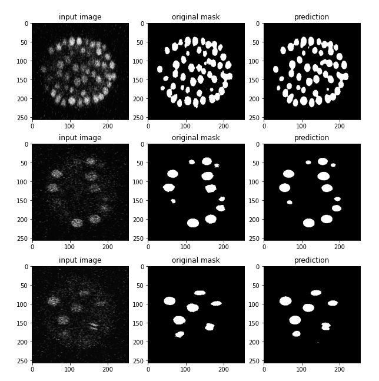

## 1. Upgrading the Cell Membrane Segmentation Model:

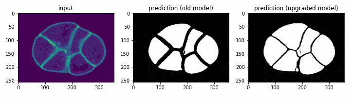

### Fixing the Flawed Data:
The first thing I investigated was the data which was used to train the existing model. Then I checked out the preprocessing notebook, and it didnt take me long to notice that the `.mat` files were converted to `.jpg`, which led to lossy edges in segmentation maps. 

This was being cleverly tackled using OpenCV based operations, but that led to larger gaps between the segmentation maps of individual cells. I re-factored the existing preprocessing code and saved the images as `.png`, which led to lossless segmentation maps. 

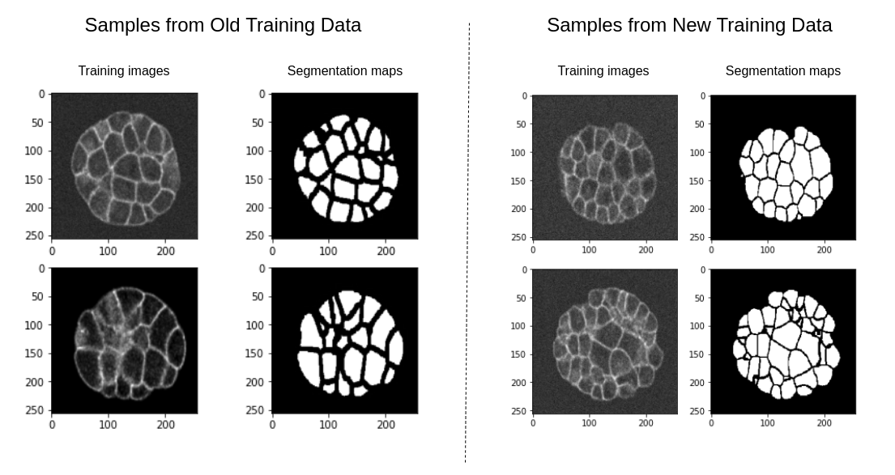

### Automated Hyperparameter Optimization:
The training pipeline was built from scratch, in order to enable Optuna trials. I used it to optimize the learning rate and batch size to maximize the IOU score. Ran 100 Optuna trials, 1 epoch each, on 10% of available data.

### Training Metrics:

### Testing Performance on Corner-Cases:

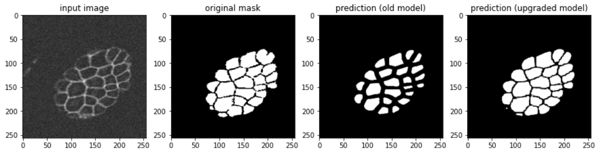
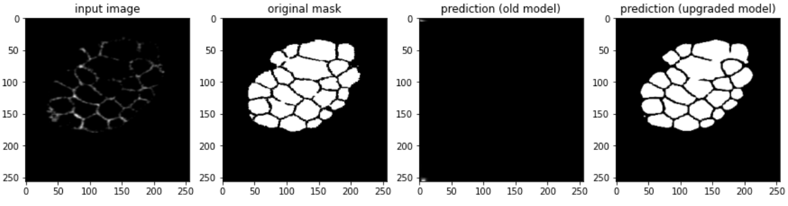

## Deploying DevoLearn Models on the Web:
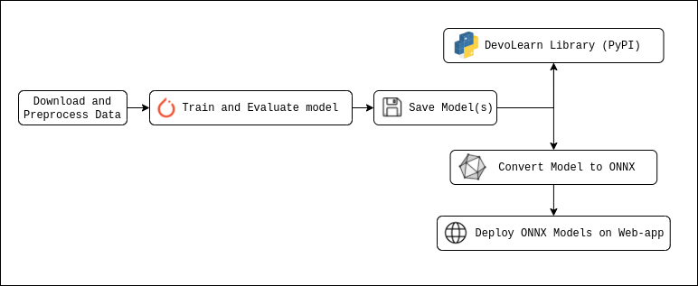

The goal of building this website was to host DevoLearn models online, and provide a GUI based experience for users to test out the models. The website is currently hosted at - [https://devolearn.herokuapp.com/](https://devolearn.herokuapp.com/), the corresponding code could be found in the [devolearn-web repository](https://github.com/DevoLearn/devolearn-web)

Installing and running a Python library on a local environment might be daunting for users having non computer science background, the GUI aims to make their lives easier with:
1. Drag-and-drop inputs
2. Example inputs.
3. Ability to zoom, pan and view images in full-screen.

### The Home page:
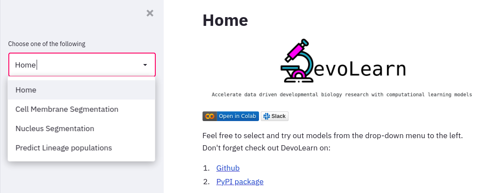

The Home page features animations that showcase what DevoLearn can be used for. It also contains links to the 
official slack channel and PyPI package. The drop-down menu to the left enables the user to select the model they wish to use.

### Cell Membrane Segmentation model:
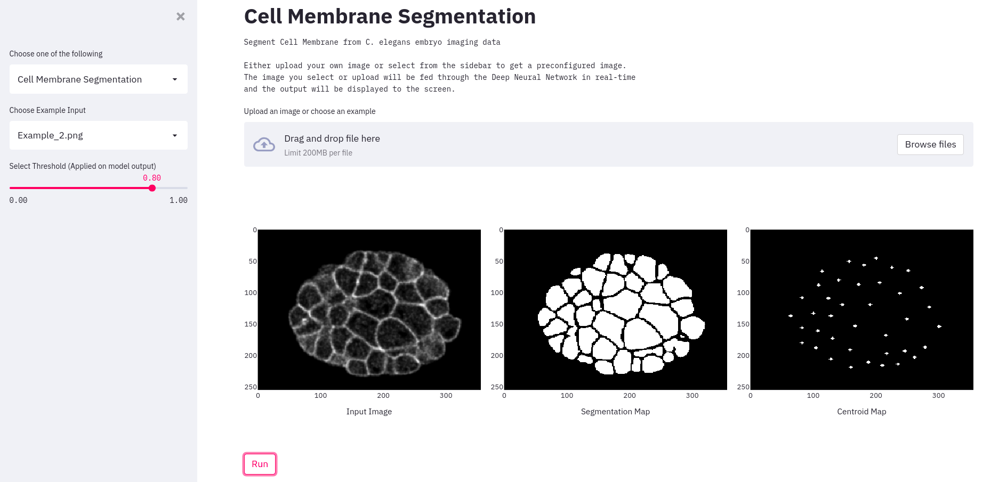

### Segment Nuclei from fluorscence microscopy data:
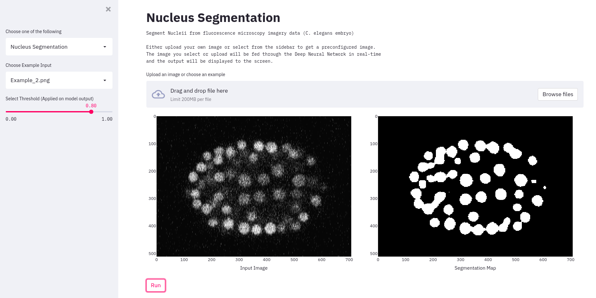

### Predict Lineage Specific Population of Cells:
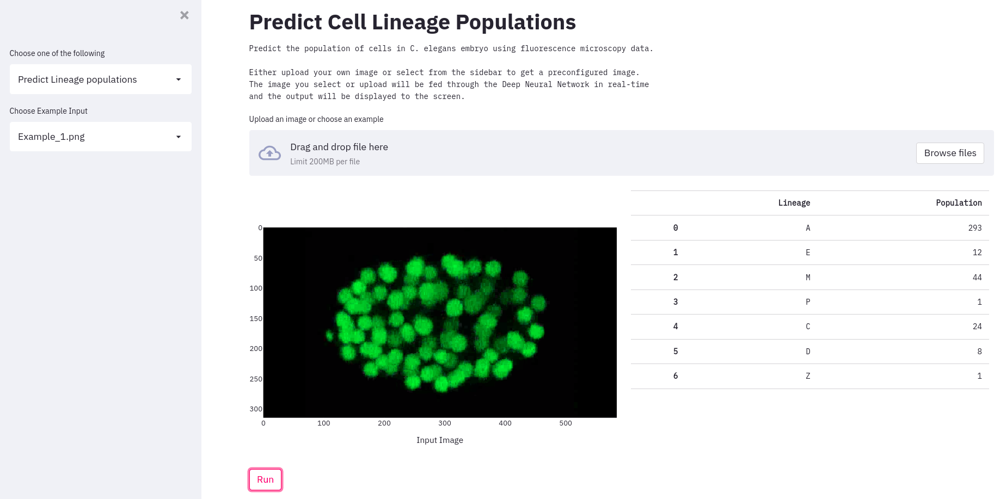

### The Threshold Slider:
The threshold slider for the 2 segmentation models applies a threshold to the output from the model. The images below showcases results with low and high thresholds.

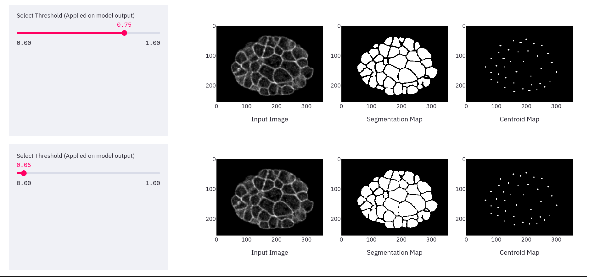
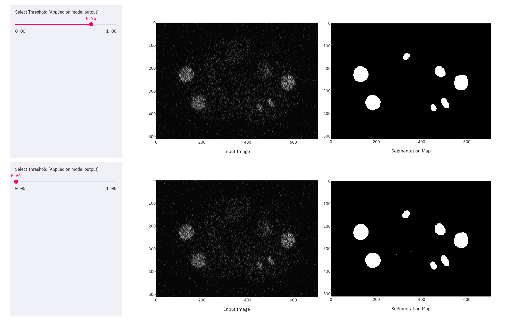

###  Interactive Plots:
The user will have the ability to zoom into, pan across and view images in full screen, the gif below highlights this feature.
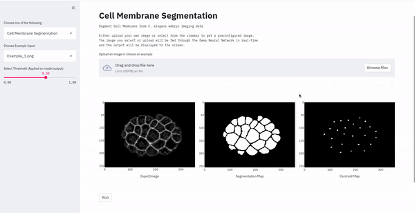

## Weekly Blog Posts
1. 
2. 
3. 
4. 
5. 
6. 
7. 
8. 
9. 

***
LINKS LINKS on headings

***
* it must be easy to identify the work you have done. (i.e. the changes you made or new code.)
* When someone goes to the provided URL it should be clear what work you did without requiring them to do signifcant additional digging.
* It should be in a stable location. The URL cannot be changed after submission.
Someone else should be able to use the content at (or referenced from) the target of the link to extend your work.
* If your work is 100% complete, they should be able to use it.
* If your work is not 100% complete, it should be clear what's left to do.

